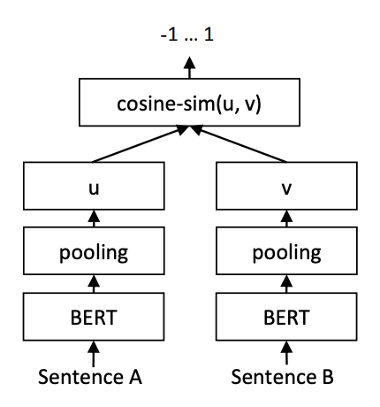
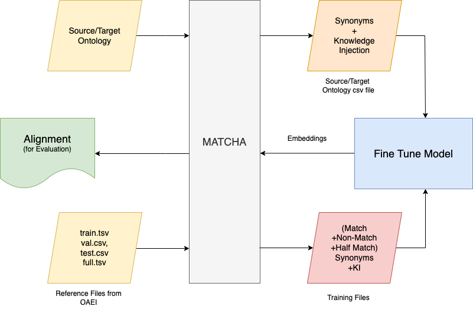

# ml-based-ontology-matching
A project to enhance ontology matching accuracy using Large Language Models (LLMs) like S-BERT.

# Abstract
Ontology matching, a pivotal process in knowledge integration, seeks to align concepts from diverse
sources. However, traditional methods often struggle with capturing nuanced semantic relationships,
relying heavily on syntactical similarities. This is where the potential of Large Language Models (LLMs)
comes into play. LLMs, like BERT, offer contextual understanding, enabling them to grasp intricate seman-
tic nuances beyond string similarity. Moreover, the concept of knowledge injection enriches the model’s
comprehension. By incorporating domain specific knowledge like hierarchical parent names or synonyms,
the model develops an enhanced comprehension of relationships within ontologies. This thesis uniquely
combines the power of fine-tuned LLMs and knowledge injection to enhance ontology matching accuracy.
The results showcase advancements in ontology alignment, outperforming conventional techniques.
This study pioneers a refined method that not only contributes to ontology matching but also sets the
stage for more accurate and contextually aware information integration. By leveraging the potential of
LLMs and enhancing domain understanding, this approach offers a promising way forward in knowledge
integration for key domains such as biomedicine.

# Introduction

Biomedical ontology alignment stands as a piv- otal mechanism for bridging the semantic gaps be- tween disparate knowledge representations within the biomedical domain. This study endeavors to unravel the intricate dynamics governing the align- ment process, introducing novel techniques that bear the potential to revolutionize how we align on- tologies in this domain.
The sheer breadth and depth of biomedical knowledge present a unique challenge in knowl- edge integration. With ontologies serving as the backbone of knowledge representation, their ac- curate alignment is crucial for effective data shar- ing, knowledge discovery, and decision-making in biomedicine. Traditional ontology matching meth- ods, however, often fall short in capturing the nu- anced semantics and intricate relationships within the biomedical ontologies.
The motivation for this research arises from the critical need to enhance ontology matching tech- niques within the biomedical domain. To this end, we harness the power of Large Language Models (LLMs), particularly the Sentence-BERT (SBERT), which excels in contextual understanding. By leveraging SBERT’s contextual understanding and introducing innovative knowledge injection tech- niques, we aim to significantly enhance the preci- sion and effectiveness of ontology matching in the biomedical domain.

In pursuit of this overarching goal, this research addresses two fundamental research questions:

1. Can LLMs be effectively fine-tuned using relatively small ontology matching training datasets?
2. Can the effectiveness of LLMs in ontology matching be enhanced by providing addi- tional context about concepts through par- ent labels, considering the concise nature of ontology labels?

To achieve these objectives, this thesis encom- passes a multi-faceted approach:

• Review of State-of-the-Art Techniques: My journey begins with a comprehensive explo- ration and review of existing ontology match- ing techniques. This includes a survey of semantic similarity measures, graph-based alignment methods, and machine learning- based approaches, identifying their strengths and limitations within the biomedical context.
• Addressing Complex Alignment Chal- lenges: The biomedical domain presents a unique set of challenges, characterized by the
vast scale of ontologies, intricate semantic relationships, and inherent heterogeneity. These challenges underscore the need for advanced ontology matching techniques capable of navigating this complex landscape.
• Fine-Tuning Sentence-BERT: At the heart of my research lies the fine-tuning process of the Sentence-BERT (SBERT) model, a vari- ant of BERT renowned for its exceptional con- textual understanding. We leverage a base- line dataset comprising biomedical ontologies to fine-tune SBERT, adapting it to the specific requirements of ontology alignment.
• Enhancement Through Knowledge Injec- tion: To further empower SBERT, we ex- plore various knowledge injection techniques. These techniques involve infusing domain- specific knowledge into the model, enhancing its comprehension of ontology concepts and their intricate relationships. These innovations have the potential to reshape the landscape of ontology alignment within the biomedical do- main.
• Comparative Analysis and Insights: My research culminates in a rigorous compara- tive analysis of results obtained from both the baseline dataset and the knowledge-injected datasets. I evaluate the quality of alignments using established criteria, including precision, recall, and F1-score, aligning with the evalua- tion standards set by the Ontology Alignment Evaluation Initiative (OAEI).
This multifaceted approach equips us with a comprehensive understanding of the strengths and weaknesses of different techniques, paving the way for more precise and contextually aware on- tology alignments in the biomedical domain.
This research contributes to the field of ontology matching in several significant ways:
• Novel Approaches: I introduce innova- tive techniques for fine-tuning LLMs using relatively small ontology matching training datasets, enhancing their adaptability to spe- cific domains.
• Contextual Enhancement: By exploring methods to provide additional context to LLMs through parent labels, we enhance their effec- tiveness in capturing complex semantic rela- tionships.
• Code Implementation: The code developed during this research is seamlessly integrated into Matcha - the ontology matching frame- work I chose to carry out my research, demon- strating the practical viability of the proposed techniques.

# Process Overview

The journey of enhancing biomedical ontology alignment through the synergy of fine-tuned Sen- tence BERT models and knowledge injection in- volves a well-structured process that unfolds in several stages, each contributing to the overarch- ing goal of advancing alignment techniques. This section provides an in-depth exploration of the key steps involved.
At the outset, the research embarks on the essential task of gathering foundational compo-
nents critical to the alignment process. This in- cludes acquiring a diverse collection of biomed- ical ontologies that serve as the building blocks of the study. Additionally, a pre-trained SBERT model, tailored specifically to biomedical text - FremyCompany/BioLORD-STAMB2-v1 [4], be- comes a cornerstone of the research endeavor. These resources collectively form the bedrock upon which subsequent experiments and analyses are constructed.


Figure 1: SBERT model architecture using cosine similarity [3]

Diversity in dataset variants lies at the heart of the research’s experimental approach. By creating eight distinct dataset variants, based on Baseline, Knowledge Injection, and Punctuation Usage, the study introduces a rich landscape of experimenta- tion possibilities. These variants are meticulously crafted to enable the exploration of different alignment techniques and approaches, each bearing a unique contribution to the quality of ontology alignment.

In the process of constructing training datasets, a systematic approach is followed to facilitate the fine-tuning of models and advance ontology alignment within the biomedical domain. Initially, synonyms for both source (SRCEntity) and target (TgtEntity) entities are meticulously extracted. Subsequently, positive matches are generated by cross-joining synonyms associated with perfectly mapped entities, denoted with a similarity score of 1.0. In contrast, negative matches are created by cross-joining synonyms from the left-hand side (LHS) entity with unmatched right-hand side (RHS) entities, signifying a lack of correspondence with a similarity score of 0. Moreover, partial matches are systematically constructed by cross-joining LHS entities with the parents and children of their corresponding RHS entities, aptly assigned a similarity score of 0.5, indicative of partial similarity.

On the other hand, the process of constructing ontology datasets is equally vital. This phase involves compiling all entities, each linked to their respective synonyms in a one-to-many structure, allowing for nuanced representation. Moreover, for every dataset variant, meticulous separation of the source and target ontologies is executed. This results in the creation of distinct CSV files for each, effectively organizing the entities and their associated synonyms. Such structured datasets serve as the groundwork for comprehensive experimentation, model fine-tuning, and in-depth analyses, propelling the advancements..

A robust baseline serves as a benchmark against which the enhancements achieved through knowledge injection can be evaluated. The SBERT algorithm, when  fine-tuned on the baseline dataset, provides an initial reference point—a starting point from which advancements can be measured.

The original model is fine-tuned multiple times - each iteration begins with the selection of a dataset variant, which may include the baseline dataset or knowledge-injected datasets employing various punctuation usage strategies. These dataset variants serve as the training data for fine-tuning the SBERT model.

Next step is to integrate these embeddings into the Matcha framework, introducing a "Matching with BERT" step alongside traditional matching methods. This integration allows for the alignment of biomedical ontologies using the enriched embeddings, leveraging the contextual understanding and domain-specific knowledge encoded within the SBERT-based embeddings. Alignment files  produced, each corresponding to a specific embedding variant, represent the outcome of our alignment strategies, ready for rigorous evaluation using the DeepOnto library. Evaluation metrics such as precision, recall, and F1-score, aligned with the OAEI evaluation criteria, allow us to assess the quality of our alignments.

Analyzing experimental findings is a critical aspect of our research, shedding light on the impact of hierarchical relationships, punctuation usage, synonym redundancy elimination, and separator choice on alignment quality. These insights guide our understanding of which techniques excel in different aspects of alignment.

Additionally, we delve into the realm of knowledge injection, investigating the effectiveness of infusing domain-specific knowledge during the fine-tuning process. This step aims to heighten the accuracy of ontology alignment, particularly within the Bioinformatics and Machine Learning domains.

# Methodology

The experimental setup for this thesis revolves around fine-tuning the Sentence BERT (SBERT) model, with multiple iterations involving various knowledge injection approaches and a baseline dataset. These datasets are derived from training files sourced from the Bio-ML (Biomedical Track of the Ontology Alignment Evaluation Initiative) track, a recognized initiative providing standardized benchmarks for ontology matching in the biomedical domain.

The Bio-ML track offers meticulously curated datasets designed to facilitate the evaluation and advancement of ontology matching algorithms within the biomedical domain. These datasets are presented in OWL (Web Ontology Language) format and encompass a wide array of biomedical ontologies, including equivalence and subsumption relationships.

The specific biomedical ontology OWL files used in this research include:

     DOID.owl (Disease Ontology): Capturing various diseases and disease-related concepts, organized hierarchically.
     NCIT.owl (NCI Thesaurus): A comprehensive biomedical ontology, encompassing concepts related to cancer and medical domains.
     OMIM.owl (Online Mendelian Inheritance in Man): A database cataloging human genes and genetic disorders.
     ORDO.owl (Orphanet Rare Disease Ontology): Specialized in rare diseases, providing structured classification and representation.

For semi-supervised training, equivalence matching reference files are employed. These files contain pairs of entities from different ontologies recognized as equivalent, forming the ground truth for evaluation. Two primary reference files, ncit2doid and omim2ordo, serve as sources of positive matches.

The process of data generation encompasses two primary categories:

     \textbfConstructing Training Data Files: These files serve for fine-tuning the SBERT model and include variants such as 
    
         Baseline (BL), 
         Knowledge Injection (KI),
         Knowledge Separation (KS),
         Knowledge Duplicate Removal (KD), 
         Knowledge Comma Separation (KC), 
         Knowledge Separation and Duplicate Removal (KSD),
         Knowledge Concatenation (KJ), and 
         Knowledge Concatenation with Duplicate Removal (KJD). \\

Positive, negative, and partial similarity matches are carefully curated to create these datasets.

    
     \textbfCreation of Ontology Data Files with Synonyms: These files are essential for generating embeddings. They comprise entities and their corresponding synonyms in a one-to-many structure, customized for each knowledge injection technique and baseline.
    
     BL - SourceOntBL, TargetOntBL
     KI - SourceOntKI, TargetOntKI
     KS - SourceOntKS, TargetOntKS
     KD - SourceOntKD, TargetOntKD
     KC - SourceOntKC, TargetOntKC
     KSD - SourceOntKSD, TargetOntKSD
     KJ - SourceOntKJ, TargetOntKJ
     KJD - SourceOntKJD, TargetOntKJD

Fine-tuning of models is executed iteratively, resulting in multiple finely-tuned models for each dataset variant. These models are tailored to specific datasets and knowledge injection techniques, enabling them to dynamically adapt to various scenarios.

     BL - Base model FremyCompany/BioLORD-STAMB2-v1 not fine-tuned on our data.
     FT - Base model FremyCompany/BioLORD-STAMB2-v1 finetuned on the BL Training dataset.
     FI - Base model FremyCompany/BioLORD-STAMB2-v1 finetuned on the KI Training dataset.
     FS - Base model FremyCompany/BioLORD-STAMB2-v1 finetuned on the KS dataset.
     FD - Base model FremyCompany/BioLORD-STAMB2-v1 finetuned on the KD dataset.
     FC - Base model FremyCompany/BioLORD-STAMB2-v1 finetuned on the KC dataset.
     FSD - Base model FremyCompany/BioLORD-STAMB2-v1 finetuned on the KSD Training dataset.
     FJ - Base model FremyCompany/BioLORD-STAMB2-v1 finetuned on the KJ Training dataset.
     FJD - Base model FremyCompany/BioLORD-STAMB2-v1 finetuned on the KJD Training dataset.

Embeddings are generated using these finely-tuned models, enriching ontology entities with additional knowledge. Different embeddings are created based on evaluators' scores \citesentence-transformers from the models, including variations such as 

     BLBL - Embeddings for BL dataset using BL model (srcBLBL, tgtBLBL)
     FTBL - Embeddings for BL dataset using fine-tuned FT model (srcFTBL, tgtFTBL)
     FIKI - Embeddings for KI dataset using fine-tuned FI model (srcFTKI, tgtFTKI)
     FSKS - Embeddings for KS dataset using fine-tuned FS model (srcFSKS, tgtFSKS)
     FTKD - Embeddings for KD dataset using fine-tuned FT model (srcFTKD, tgtFTKD)
     FDKD - Embeddings for KD dataset using fine-tuned FD model (srcFDKD, tgtFDKD)
     FCKC - Embeddings for KC dataset using fine-tuned FC model (srcFCKC, tgtFCKC)
     FSDKSD - Embeddings for KSD dataset using fine-tuned FSD model (srcFSDKSD, tgtFSDKSD)
     FJKJ - Embeddings for KJ dataset using fine-tuned FJ model (srcFJKJ tgtFJKJ)
     FJDKJD - Embeddings for KJD dataset using fine-tuned FJD model (srcFJDKJD, tgtFJDKJD)

Enhanced matching with BERT is implemented by integrating these embeddings into the Matcha framework, introducing a "Matching with BERT step" to traditional matching methods. Alignment files are produced, with one corresponding to each embedding variant.

Finally, the alignment files are rigorously evaluated using the DeepOnto library, following OAEI  evaluation criteria to assess the performance of the fine-tuned SBERT model under different knowledge injection scenarios.

## Files Included here 

Due to the proprietary nature of the project, only specific files that were written by me, are included in this repository. These files have been added to provide insight into the project without disclosing sensitive information.

